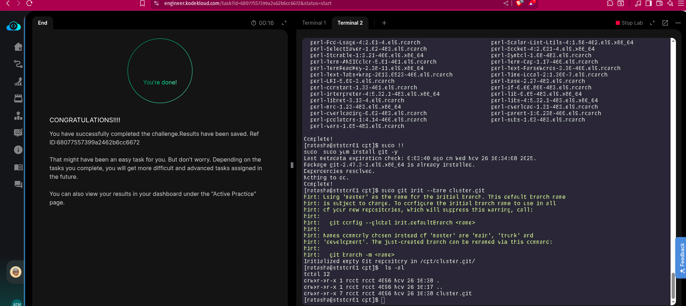

The Nautilus development team has provided requirements to the DevOps team for a new application development project, specifically requesting the establishment of a Git repository. Follow the instructions below to create the Git repository on the Storage server in the Stratos DC:

Utilize yum to install the git package on the Storage Server.

```bash
sudo yum install -y git
```

Create a bare repository named /opt/cluster.git (ensure exact name usage).

## Notes:

The --bare flag creates a repository that doesn’t have a working directory, making it impossible to edit files and commit changes in that repository. You would create a bare repository to git push and git pull from, but never directly commit to it. Central repositories should always be created as bare repositories because pushing branches to a non-bare repository has the potential to overwrite changes. Think of --bare as a way to mark a repository as a storage facility, as opposed to a development environment. This means that for virtually all Git workflows, the central repository is bare, and developers local repositories are non-bare.

It is structured differently from a standard repository, storing the entire Git history directly in the root folder instead of within a .git subdirectory

Bare repositories can be created using the git init --bare command,

Alternatively, an existing non-bare repository can be converted into a bare one using git clone --bare.

## Soution:

```bash
sudo git init --bare /opt/cluster.git
```

