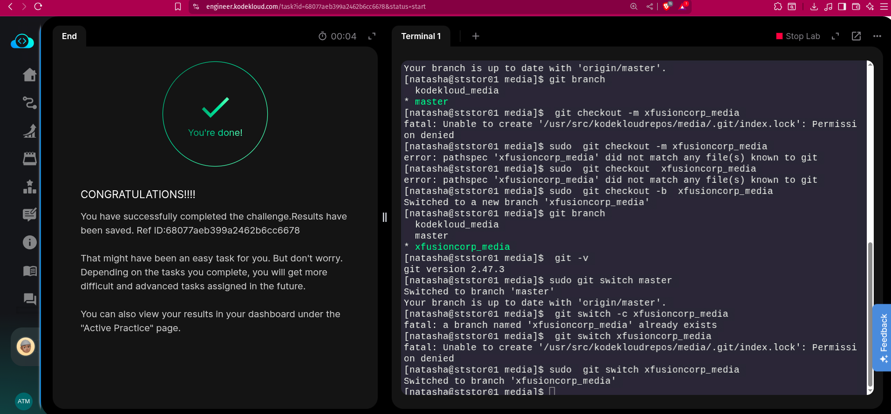

Nautilus developers are actively working on one of the project repositories, /usr/src/kodekloudrepos/media. Recently, they decided to implement some new features in the application, and they want to maintain those new changes in a separate branch. Below are the requirements that have been shared with the DevOps team:


On Storage server in Stratos DC create a new branch xfusioncorp_media from master branch in /usr/src/kodekloudrepos/media git repo.


Please do not try to make any changes in the code.

## SOLUTION

```bash
ssh natash@ststor01

cd /usr/src/kodekloudrepos/media
```

### Verify on which branch you're working on
```bash
git branch  #(-r or -v)
```

## Creating a new branch:

Simply to create a new branch,
```bash
git branch <branch_name>
```
To create a new branch and switch to it at the same time

```bash
git checkout -b xfusioncorp_media
```

To create a new Git branch and switch to it in one command, you can use either :
```bash
git checkout -b <branch-name> 
#or the newer 
git switch -c <branch-name>.
```


