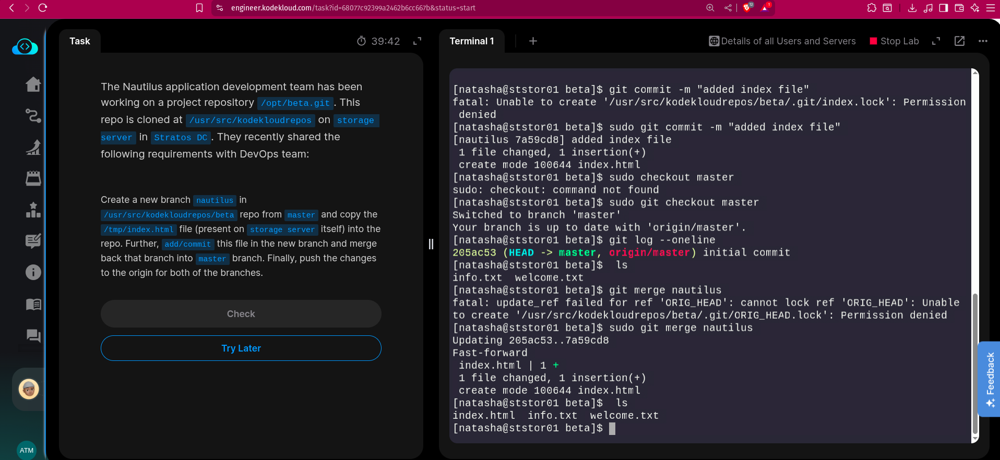
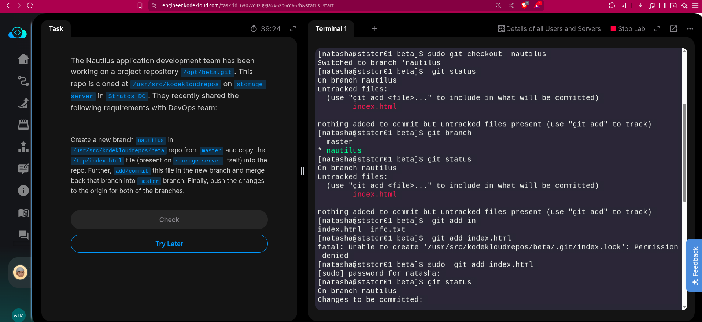
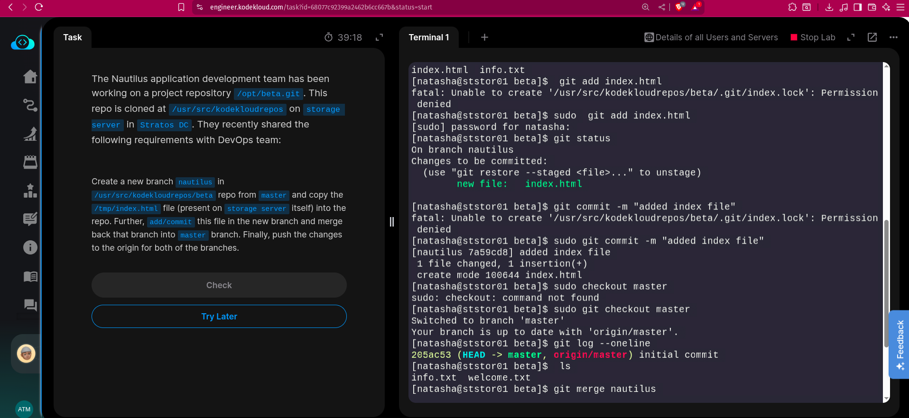
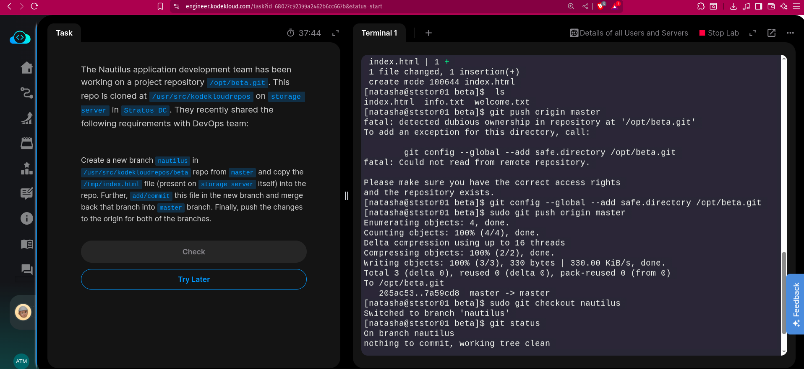
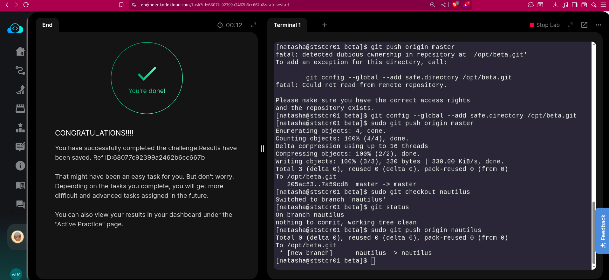

The Nautilus application development team has been working on a project repository /opt/beta.git. This repo is cloned at /usr/src/kodekloudrepos on storage server in Stratos DC. They recently shared the following requirements with DevOps team:


Create a new branch nautilus in /usr/src/kodekloudrepos/beta repo from master and copy the /tmp/index.html file (present on storage server itself) into the repo.

Further, add/commit this file in the new branch and merge back that branch into master branch. Finally, push the changes to the origin for both of the branches.


# SOLUTION

### Create a new branch nautilus and switch to it.
```bash
sudo git checkout -b nautilus
```

```bash
cd **/usr/src/kodekloudrepos/beta**  
cp /tmp/index.html .
```

Now, commit this file on nautilus branch,

```bash
git add index.html
git commit -m "Index file added"
```
### Merge our new branch with master

Checkout to the master branch
```bash
git checkout master
git merge nautilus
git push origin master
```

## Snapshots





