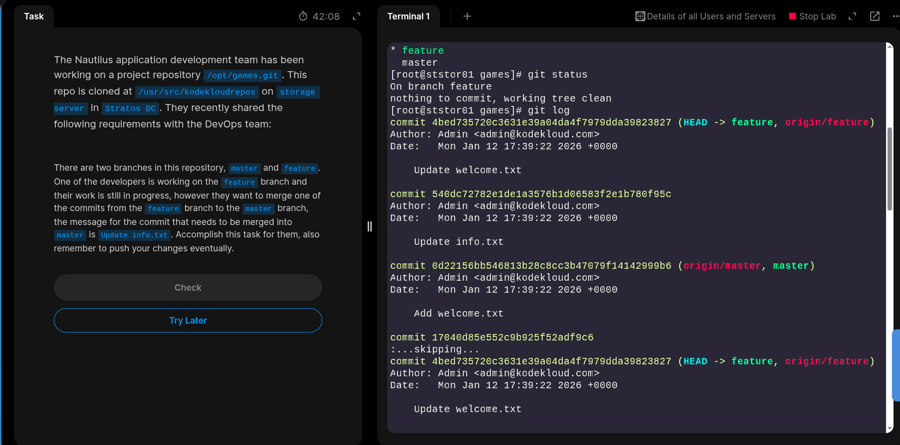
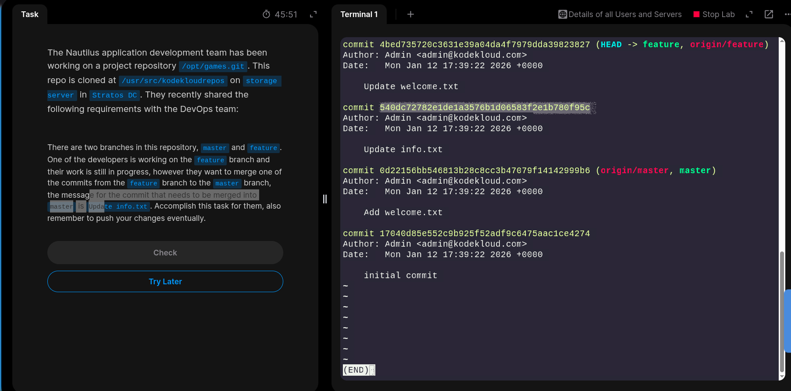
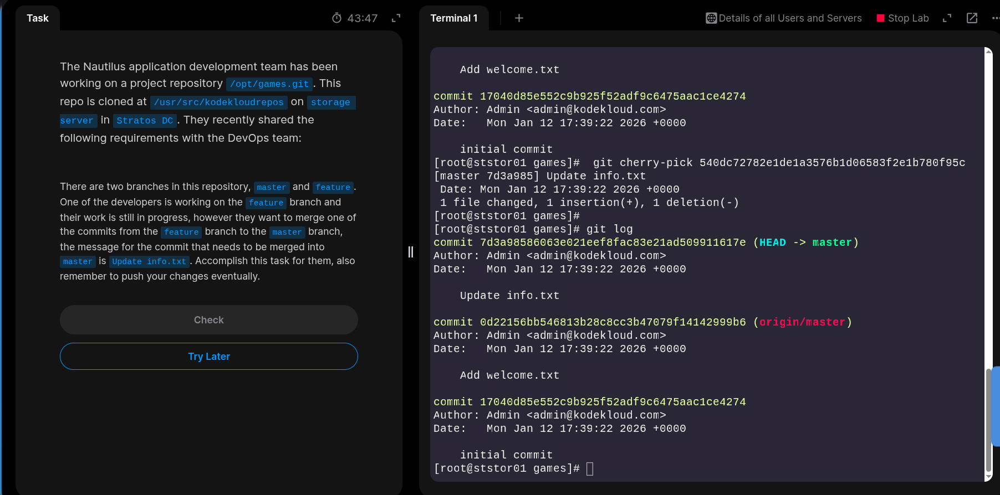
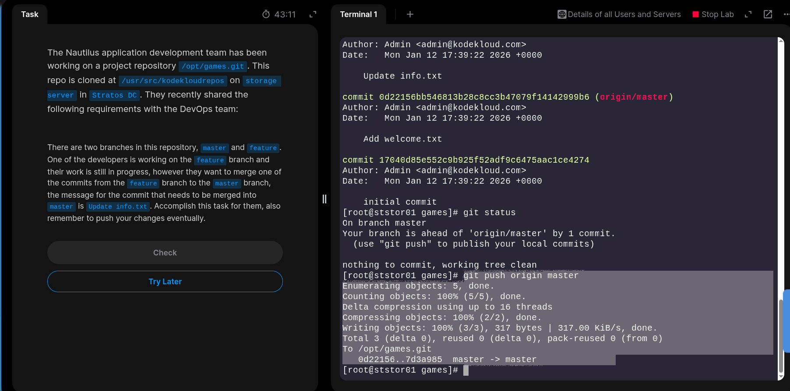
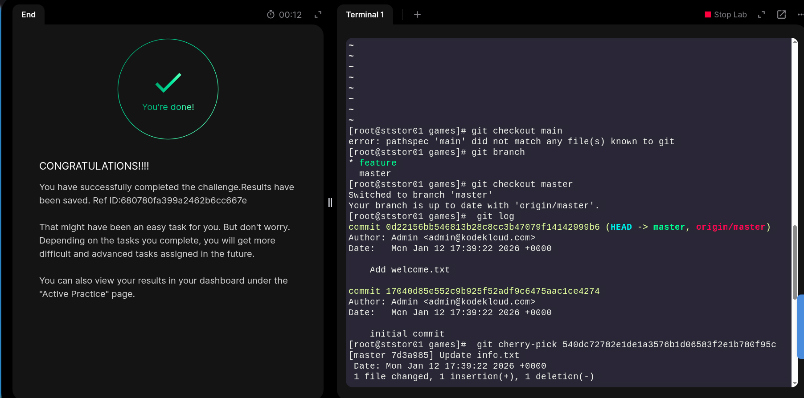

The Nautilus application development team has been working on a project repository /opt/games.git. This repo is cloned at /usr/src/kodekloudrepos on storage server in Stratos DC. They recently shared the following requirements with the DevOps team:


There are two branches in this repository, master and feature. One of the developers is working on the feature branch and their work is still in progress, however they want to merge one of the commits from the feature branch to the master branch, the message for the commit that needs to be merged into master is Update info.txt. Accomplish this task for them, also remember to push your changes eventually.

### SOLUTION
Cherry picking is the act of picking a commit from a branch and applying it to another.

For example
```bash
git cherry-pick commithash
```
In this example commithash is a commit reference. You can find a commit reference by using git log. 
Then pick the commit you want to apply to another branch.
```bash
git checkout main

git cherry-pick commithash
```

```bash

# Ensure you are on the feature branch
[root@ststor01 games]#  git branch
* feature
  master

# Git log to see the commit history
[root@ststor01 games]# git log
commit 4bed735720c3631e39a04da4f7979dda39823827 (HEAD -> feature, origin/feature)
Author: Admin <admin@kodekloud.com>
Date:   Mon Jan 12 17:39:22 2026 +0000

    Update welcome.txt

# We need to pick this commit hash according to the task given. Copy this commit hash.
commit 540dc72782e1de1a3576b1d06583f2e1b780f95c
Author: Admin <admin@kodekloud.com>
Date:   Mon Jan 12 17:39:22 2026 +0000

    Update info.txt

# Go to master branch
[root@ststor01 games]# git checkout master
Switched to branch 'master'
Your branch is up to date with  

[root@ststor01 games]#  git log
commit 0d22156bb546813b28c8cc3b47079f14142999b6 (HEAD -> master, origin/master)
Author: Admin <admin@kodekloud.com>
Date:   Mon Jan 12 17:39:22 2026 +0000

    Add welcome.txt

commit 17040d85e552c9b925f52adf9c6475aac1ce4274
Author: Admin <admin@kodekloud.com>
Date:   Mon Jan 12 17:39:22 2026 +0000

    initial commit

# Choose the commit hash you want to pick from feature branch and apply it in the master branch
[root@ststor01 games]#  git cherry-pick 540dc72782e1de1a3576b1d06583f2e1b780f95c
[master 7d3a985] Update info.txt
 Date: Mon Jan 12 17:39:22 2026 +0000
 1 file changed, 1 insertion(+), 1 deletion(-)

[root@ststor01 games]# git log
commit 7d3a98586063e021eef8fac83e21ad509911617e (HEAD -> master)
Author: Admin <admin@kodekloud.com>
Date:   Mon Jan 12 17:39:22 2026 +0000

    Update info.txt

commit 0d22156bb546813b28c8cc3b47079f14142999b6 (origin/master)
Author: Admin <admin@kodekloud.com>
Date:   Mon Jan 12 17:39:22 2026 +0000

    Add welcome.txt

commit 17040d85e552c9b925f52adf9c6475aac1ce4274
Author: Admin <admin@kodekloud.com>
Date:   Mon Jan 12 17:39:22 2026 +0000

    initial commit


#Push the change to origin
[root@ststor01 games]# git push origin master
Enumerating objects: 5, done.
Counting objects: 100% (5/5), done.
Delta compression using up to 16 threads
Compressing objects: 100% (2/2), done.
Writing objects: 100% (3/3), 317 bytes | 317.00 KiB/s, done.
Total 3 (delta 0), reused 0 (delta 0), pack-reused 0 (from 0)
To /opt/games.git
   0d22156..7d3a985  master -> master
```

### Snapshots






