Max want to push some new changes to one of the repositories but we don't want people to push directly to master branch, since that would be the final version of the code. It should always only have content that has been reviewed and approved. We cannot just allow everyone to directly push to the master branch. So, let's do it the right way as discussed below:


SSH into storage server using user max, password Max_pass123 . There you can find an already cloned repo under Max user's home.


Max has written his story about The 🦊 Fox and Grapes 🍇


Max has already pushed his story to remote git repository hosted on Gitea branch story/fox-and-grapes


Check the contents of the cloned repository. Confirm that you can see Sarah's story and history of commits by running git log and validate author info, commit message etc.


Max has pushed his story, but his story is still not in the master branch. Let's create a Pull Request(PR) to merge Max's story/fox-and-grapes branch into the master branch


Click on the Gitea UI button on the top bar. You should be able to access the Gitea page.


UI login info:

- Username: 
- Password: 

PR title : Added fox-and-grapes story

PR pull from branch: story/fox-and-grapes (source)

PR merge into branch: master (destination)


Before we can add our story to the master branch, it has to be reviewed. So, let's ask tom to review our PR by assigning him as a reviewer


Add tom as reviewer through the Git Portal UI

Go to the newly created PR

Click on Reviewers on the right

Add tom as a reviewer to the PR

Now let's review and approve the PR as user Tom


Login to the portal with the user tom

Logout of Git Portal UI if logged in as max

UI login info:

- Username: 

- Password: 

PR title : Added fox-and-grapes story

Review and merge it.

Great stuff!! The story has been merged! 👏


Note: For these kind of scenarios requiring changes to be done in a web UI, please take screenshots so that you can share it with us for review in case your task is marked incomplete. You may also consider using a screen recording software such as loom.com to record and share your work.

### SOLUTION

```bash
thor@jumphost ~$ ssh max@ststor01 
The authenticity of host 'ststor01 (172.16.238.15)' can't be established.
ED25519 key fingerprint is SHA256:afxZ0/bJkwUsMGoYnu8349m7ZQi+MTkp5aH/+DqgitM.
This key is not known by any other names
Are you sure you want to continue connecting (yes/no/[fingerprint])? yes
Warning: Permanently added 'ststor01' (ED25519) to the list of known hosts.
max@ststor01's password: 
Welcome to xFusionCorp Storage server.

max $ ls
story-blog
max $ git log
fatal: Not a git repository (or any of the parent directories): .git
max $  cd story-blog/
max (story/fox-and-grapes)$  ls
fox-and-grapes.txt  frogs-and-ox.txt    lion-and-mouse.txt

max (story/fox-and-grapes)$  git log
commit 77f6d2d52d4ac6f406db955191e872d4e8c6f43f
Author: max <max@stratos.xfusioncorp.com>
Date:   Tue Jan 13 16:43:28 2026 +0000

    Added fox-and-grapes story

commit f1f43f83b3fa95c007d7f9b3ae38d93e470e241e
Merge: ef83462 727d225
Author: sarah <sarah@stratos.xfusioncorp.com>
Date:   Tue Jan 13 16:43:27 2026 +0000

    Merge branch 'story/frogs-and-ox'

commit ef834629ae62a76d963272fe2bdec517efe65529
Author: sarah <sarah@stratos.xfusioncorp.com>
Date:   Tue Jan 13 16:43:27 2026 +0000

    Fix typo in story title

commit 727d225eeade7f14332e9b8cc64ff67dfc523846
Author: sarah <sarah@stratos.xfusioncorp.com>
Date:   Tue Jan 13 16:43:27 2026 +0000

    Completed frogs-and-ox story

commit fc5855f8118f4238c0e64c7d9e284a94a0cc2b6f
Author: sarah <sarah@stratos.xfusioncorp.com>
Date:   Tue Jan 13 16:43:27 2026 +0000

    Added the lion and mouse story

```
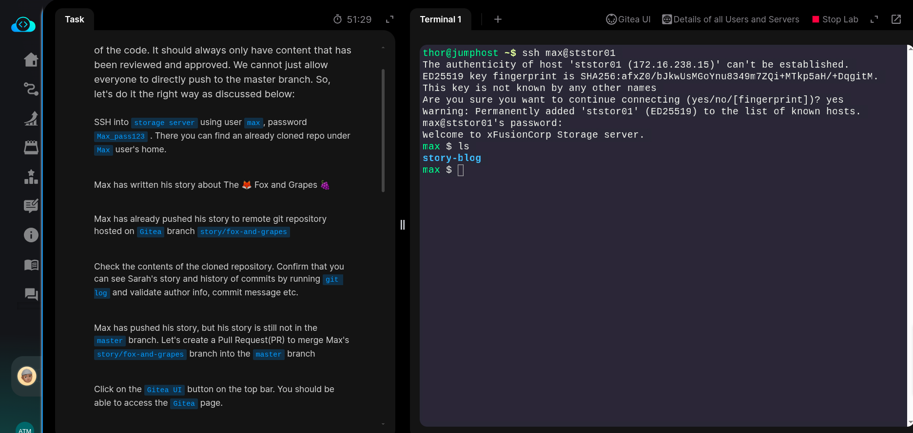
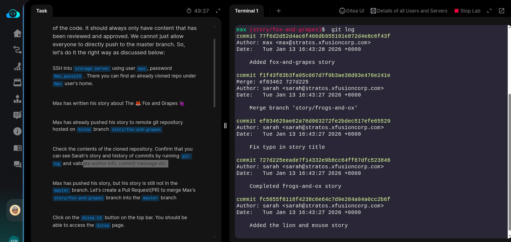

### GitTea part

Now creating a pull request 

PR title : Added fox-and-grapes story

PR pull from branch: story/fox-and-grapes (source)

PR merge into branch: master (destination)

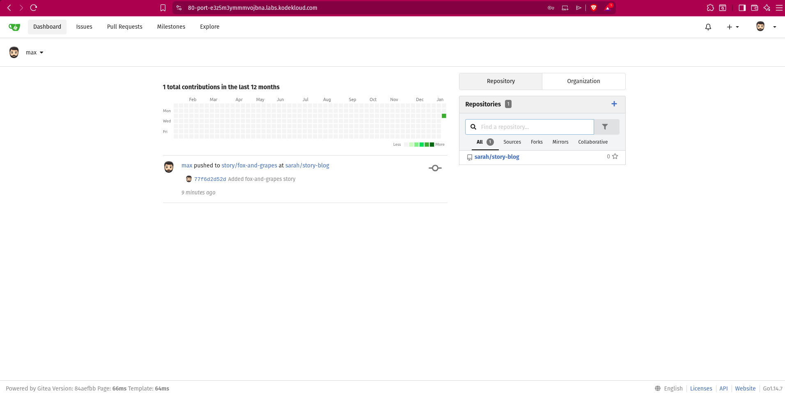
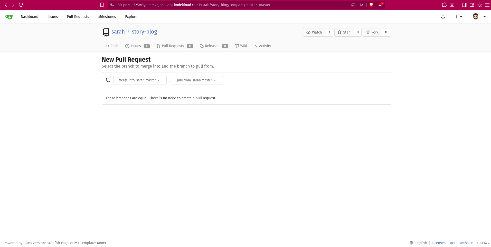
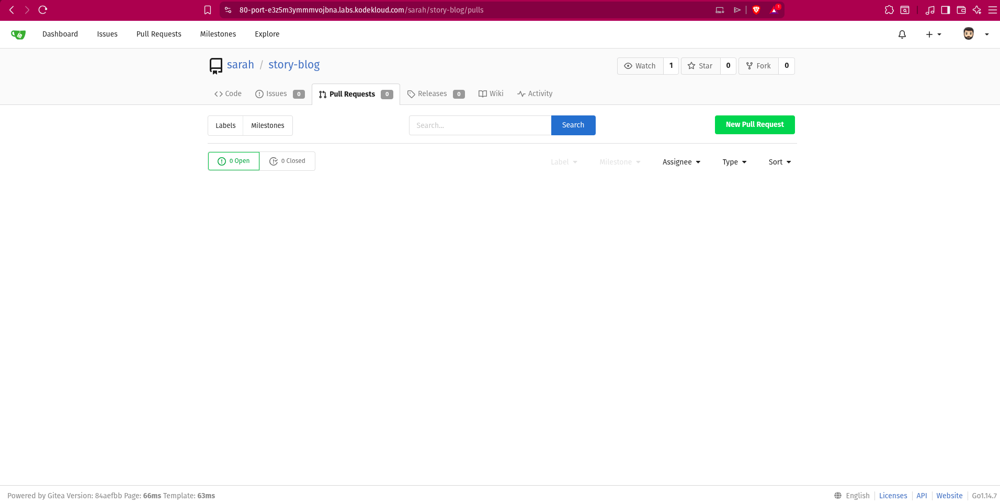
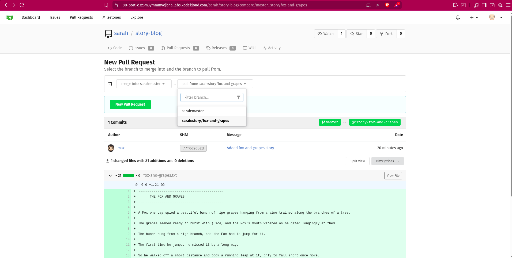


Add tom as a reviewer to the PR to review and approve the PR as user Tom

Login to the portal with the user tom and Review PR and merge it to the main branch.

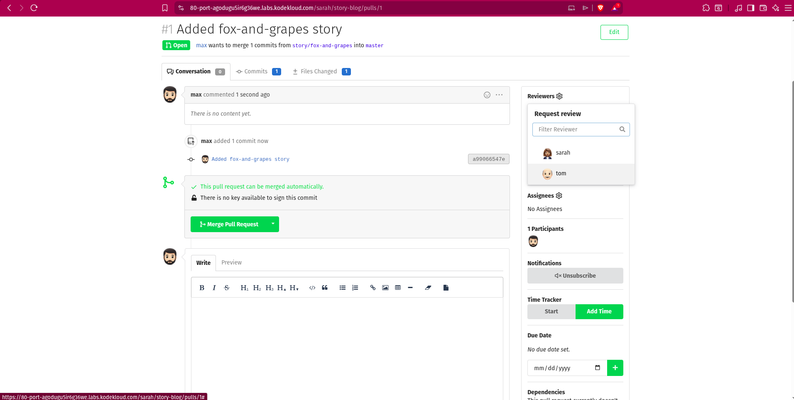
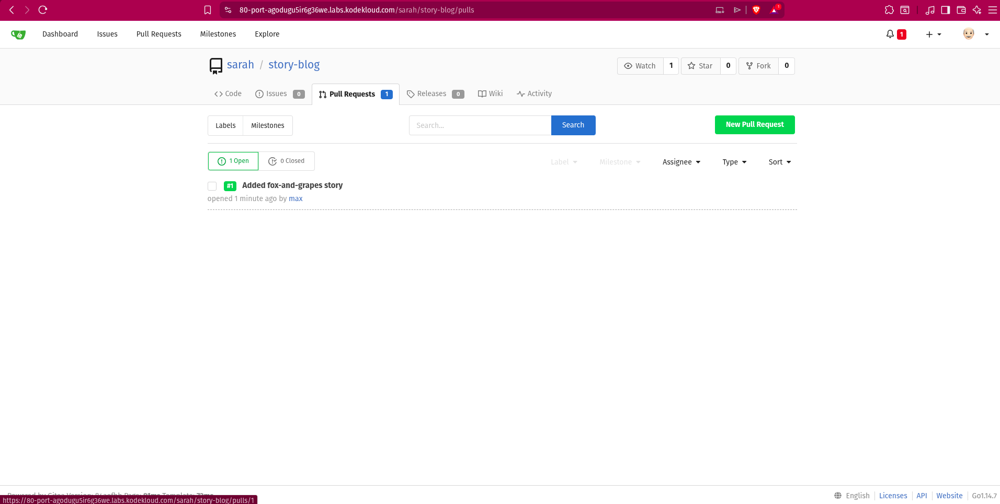
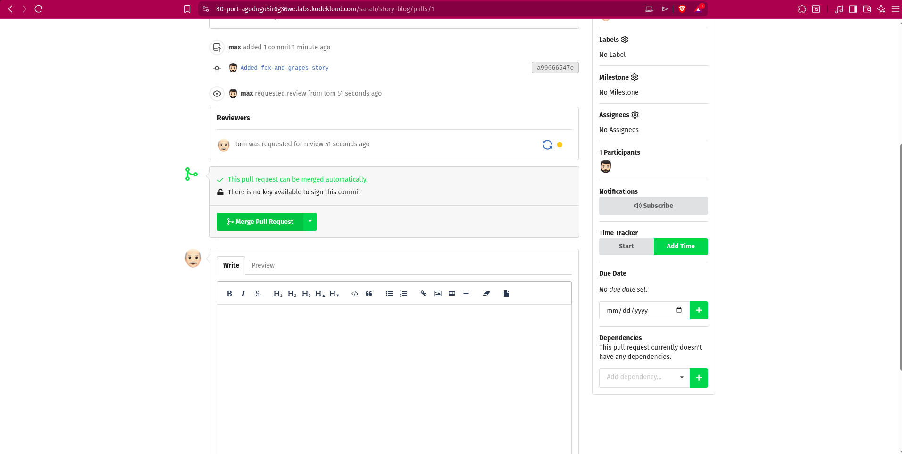
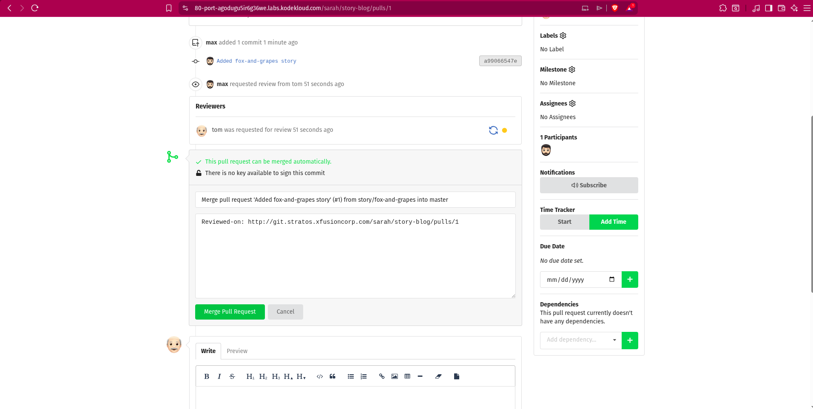
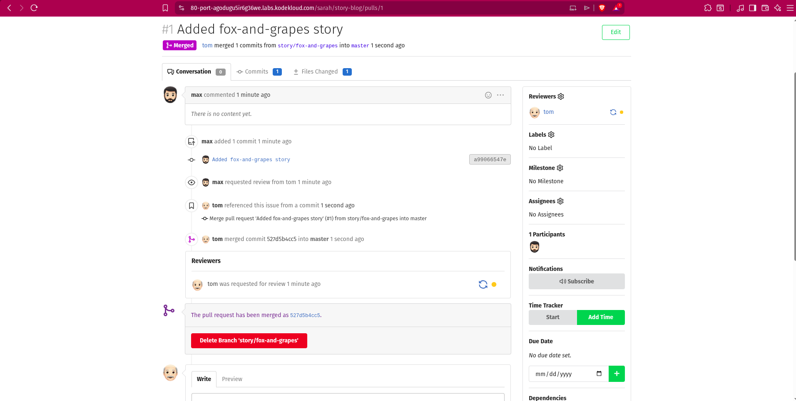

