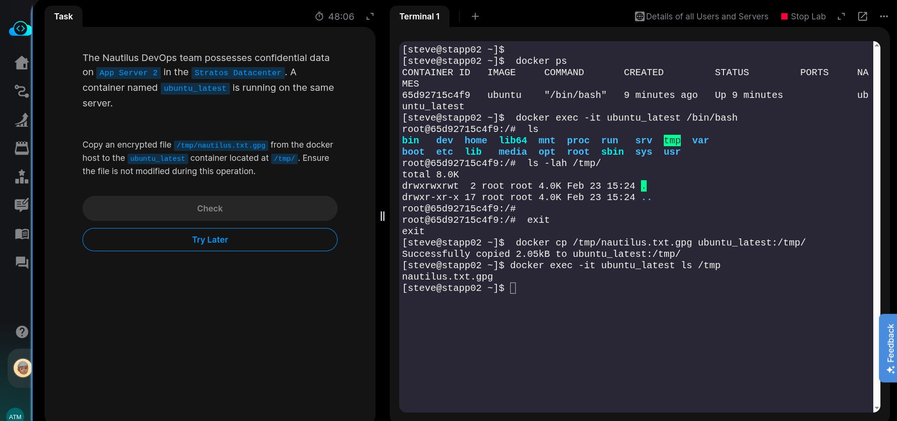
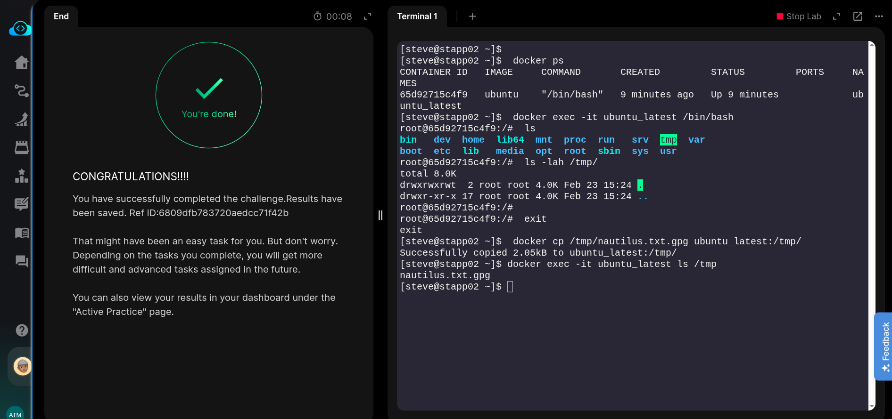

The Nautilus DevOps team possesses confidential data on App Server 2 in the Stratos Datacenter. A container named ubuntu_latest is running on the same server.


- Copy an encrypted file **/tmp/nautilus.txt.gpg** from the docker host to the** ubuntu_latest** container located at /tmp/. Ensure the file is not modified during this operation.


### SOLUTION steps:

1. Ssh into App Server 2
```bash
ssh steve@stapp02
```
2. Copy file from host to container
```bash
docker cp /tmp/nautilus.txt.gpg ubuntu_latest:/tmp/
```

### Verify
```bash

docker exec -it ubuntu_latest ls /tmp
```
OR exec into bash shell inside the container and perform listing.
```bash
docker exec -it ubuntu_latest /bin/bash

ls -l /tmp
```


