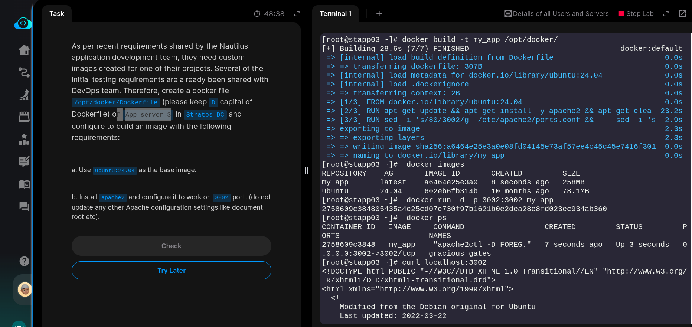
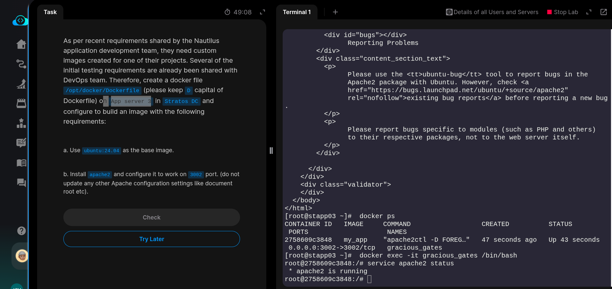

As per recent requirements shared by the Nautilus application development team, they need custom images created for one of their projects. Several of the initial testing requirements are already been shared with DevOps team. Therefore, create a docker file /opt/docker/Dockerfile (please keep D capital of Dockerfile) on App server 2 in Stratos DC and configure to build an image with the following requirements:

a. Use ubuntu:24.04 as the base image.

b. Install apache2 and configure it to work on 6000 port. (do not update any other Apache configuration settings like document root etc).

### SOLUTION steps:

```bash
# ssh into app server 2
ssh steve@stapp02 
sudo -i

# Create a docker file /opt/docker/Dockerfile
vi /opt/docker/Dockerfile

# Build image from Dockerfile
docker build -t my_app /opt/docker

#Run the image
docker run -d -p 6000:6000 my_app
```


