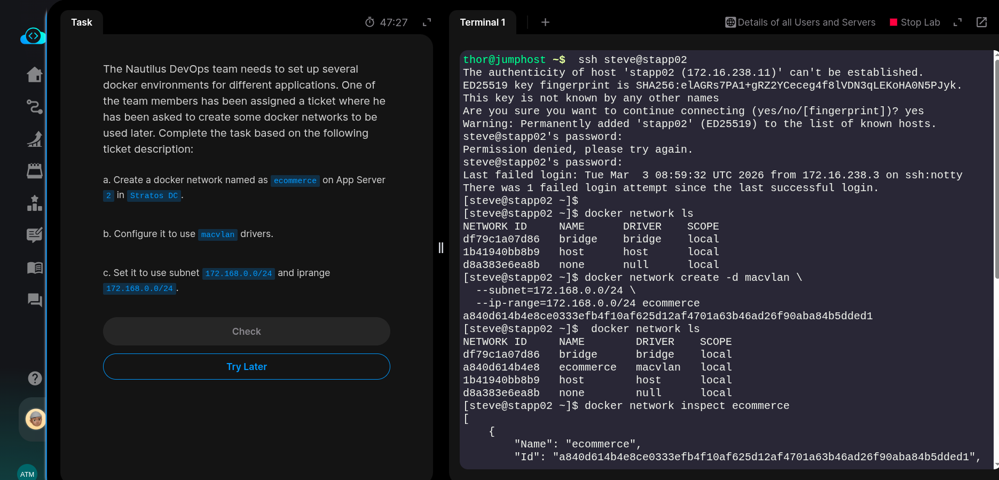
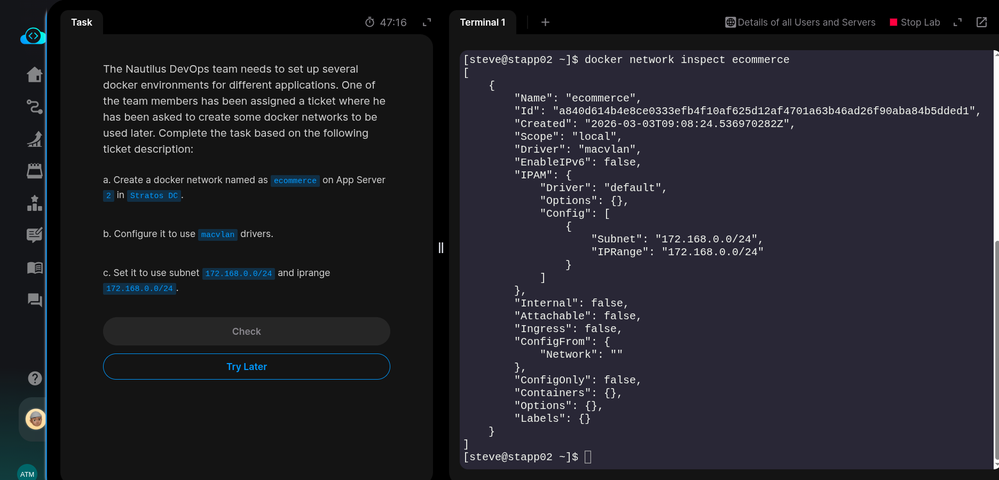
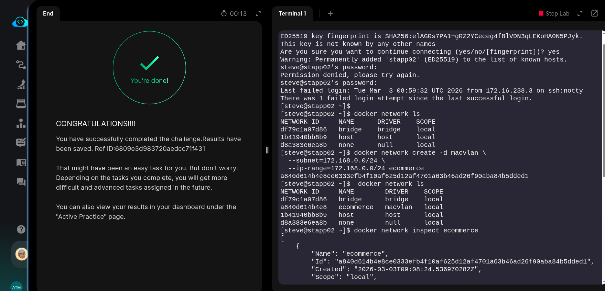

The Nautilus DevOps team needs to set up several docker environments for different applications. One of the team members has been assigned a ticket where he has been asked to create some docker networks to be used later. Complete the task based on the following ticket description:


a. Create a docker network named as ecommerce on App Server 2 in Stratos DC.


b. Configure it to use macvlan drivers.


c. Set it to use subnet 172.168.0.0/24 and iprange 172.168.0.0/24.

### SOLUTION steps:

```bash
# ssh into app server 2
ssh steve@stapp02
sudo -i
```

### Create a docker network called ecommerce with macvlan drivers, subnet = 172.168.0.0/24 and ip-range = 172.168.0.0/24
```bash
docker network create -d macvlan \
    --subnet=172.168.0.0/24 \
    --ip-range=172.168.0.0/24 \
    ecommerce
```

### Verify
```bash
docker network ls
docker network inspect ecommerce
```



