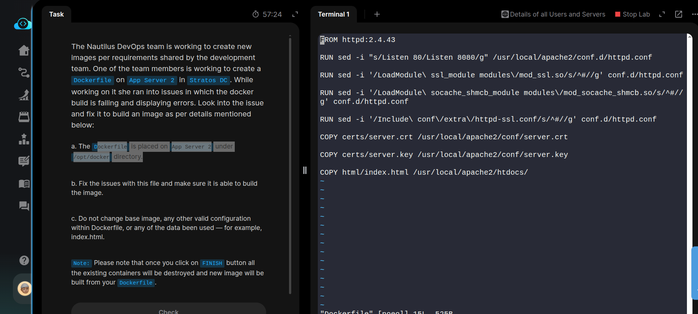
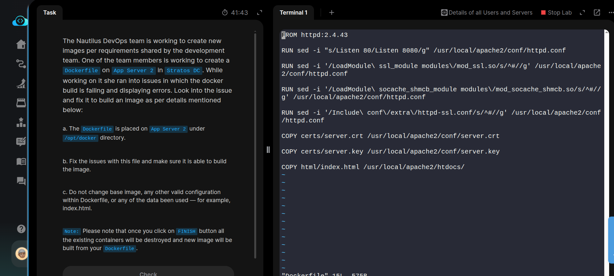

The Nautilus DevOps team is working to create new images per requirements shared by the development team. One of the team members is working to create a Dockerfile on App Server 2 in Stratos DC. While working on it she ran into issues in which the docker build is failing and displaying errors. Look into the issue and fix it to build an image as per details mentioned below:


a. The Dockerfile is placed on App Server 2 under /opt/docker directory.


b. Fix the issues with this file and make sure it is able to build the image.


c. Do not change base image, any other valid configuration within Dockerfile, or any of the data been used — for example, index.html.


Note: Please note that once you click on FINISH button all the existing containers will be destroyed and new image will be built from your Dockerfile.

### Broken dockerfile
```bash

FROM httpd:2.4.43
RUN sed -i "s/Listen 80/Listen 8080/g" /usr/local/apache2/conf.d/httpd.conf
RUN sed -i '/LoadModule\ ssl_module modules\/mod_ssl.so/s/^#//g' conf.d/httpd.conf
RUN sed -i '/LoadModule\ socache_shmcb_module modules\/mod_socache_shmcb.so/s/^#//g' conf.d/httpd.conf
RUN sed -i '/Include\ conf\/extra\/httpd-ssl.conf/s/^#//g' conf.d/httpd.conf
COPY certs/server.crt /usr/local/apache2/conf/server.crt
COPY certs/server.key /usr/local/apache2/conf/server.key
COPY html/index.html /usr/local/apache2/htdocs/
```


We can see that there is missing full path in **sed** commands and the configuration file has to be in **/usr/local/apache2/conf/httpd.conf**. So we have to replace the file path **conf.d/httpd.conf** with full path **/usr/local/apache2/conf/httpd.conf** in our dockerfile. Note that it's **conf** not **conf.d** .

### Fixed Dockerfile
```bash
FROM httpd:2.4.43
RUN sed -i "s/Listen 80/Listen 8080/g" /usr/local/apache2/conf/httpd.conf
RUN sed -i '/LoadModule\ ssl_module modules\/mod_ssl.so/s/^#//g' /usr/local/apache2/conf/httpd.conf
RUN sed -i '/LoadModule\ socache_shmcb_module modules\/mod_socache_shmcb.so/s/^#//g' /usr/local/apache2/conf/httpd.conf
RUN sed -i '/Include\ conf\/extra\/httpd-ssl.conf/s/^#//g' /usr/local/apache2/conf/httpd.conf
COPY certs/server.crt /usr/local/apache2/conf/server.crt
COPY certs/server.key /usr/local/apache2/conf/server.key
COPY html/index.html /usr/local/apache2/htdocs/
```


### Key Changes
Configuration file paths
- **Before**: conf.d/httpd.conf
- **After**: /usr/local/apache2/conf/httpd.conf

### Test the Fix
#### Build docker image
```bash
cd /opt/docker/
docker build -t test-app .
```
#### Run and Test container
```bash
# Start container
docker run -d -p 6000:6000 --name test-app-container test-app
# Verify
curl localhost:6000
# Check container status
docker ps
```