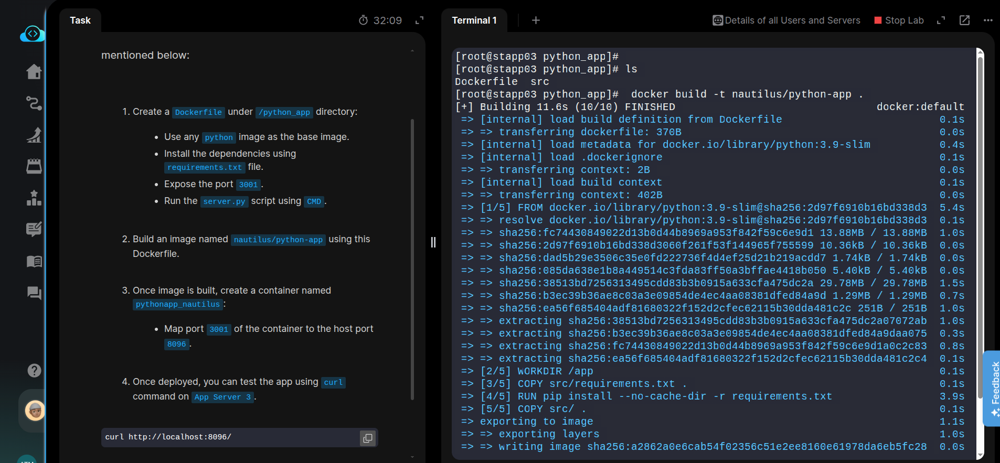
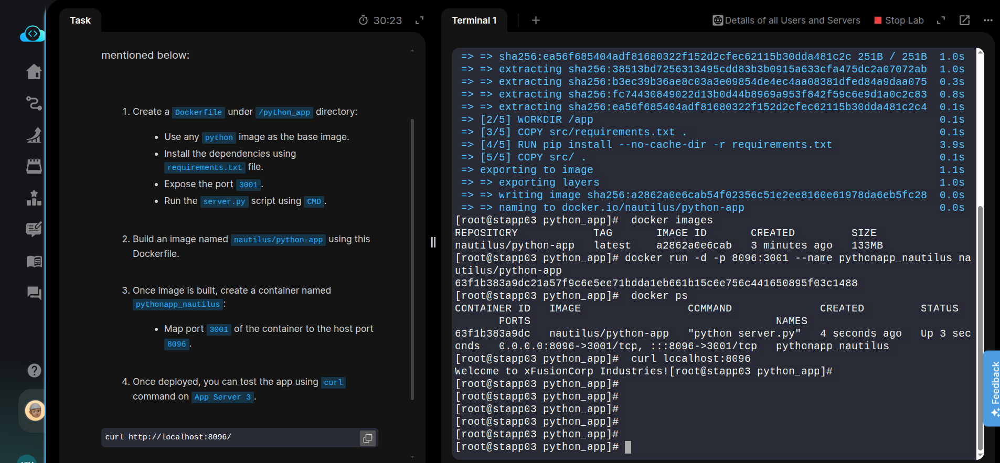

## INSTRUCTION

A python app needed to be Dockerized, and then it needs to be deployed on App Server 3. We have already copied a requirements.txt file (having the app dependencies) under **/python_app/src/** directory on App Server 3. Further complete this task as per details mentioned below:

### TASK 1
- Create a Dockerfile under /python_app directory:
- Use any python image as the base image.
- Install the dependencies using requirements.txt file.
- Expose the port **3001**.
- Run the server.py script using CMD.

### TASK 2
- Build an image named nautilus/python-app using this Dockerfile.

### TASK 3
- Once image is built, create a container named **pythonapp_nautilus**:
- Map port **3001** of the container to the **host port** **8096**.

Once deployed, you can test the app using curl command on App Server 3.
```bash
curl http://localhost:8096/
```

## SOLUTION STEPS
```bash
# ssh into server3
ssh banner@stapp03

cd /python_app
```

Make Dockerfile for Python Application:

[Dockerfile](Dockerfile)

#### Commands for building and running the docker containers for Python App.
```bash
# Build the image
docker build -t nautilus/python-app .

# Run as container
docker run -d -p 8096:3001 --name pythonapp_nautilus nautilus/python-app

# Verify Images and containers are running
docker images

docker ps 
```


