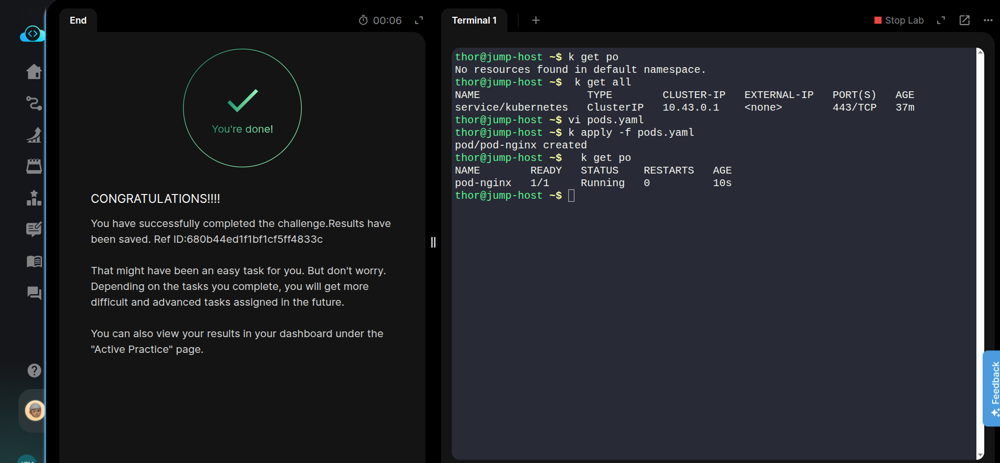

### TASK INSTRUCTION

The Nautilus DevOps team is diving into Kubernetes for application management. One team member has a task to create a pod according to the details below:

- Create a pod named **pod-nginx** using the **nginx** image with the **latest tag**. Ensure to specify the tag as nginx:latest.
- Set the app label to nginx_app, and name the container as nginx-container.

Here is the pod_specs file for nginx.

[Pods](pods_spec_nginx.yaml)

#### Steps/Commands
```bash
# Create a pod specification file
vi nginx_pods.yaml

# Apply the pod
kubectl apply -f nginx_pods.yaml 
```


