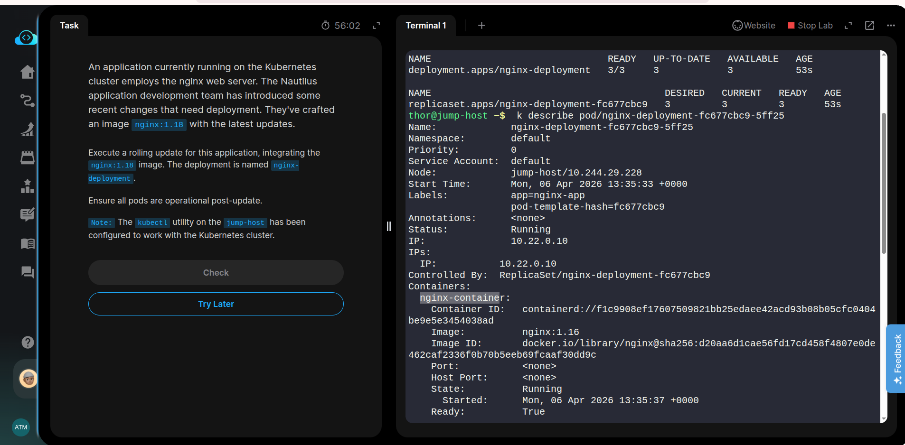
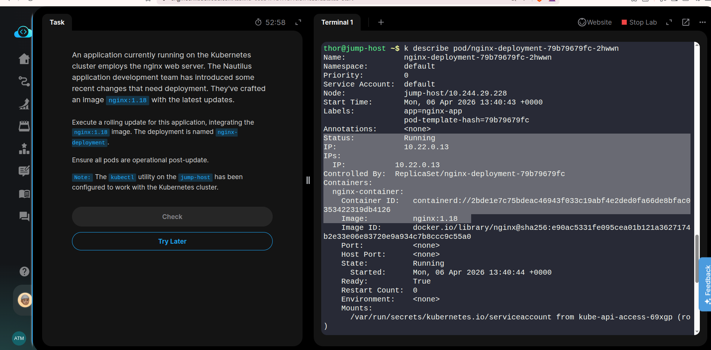

An application currently running on the Kubernetes cluster employs the nginx web server. The Nautilus application development team has introduced some recent changes that need deployment. They've crafted an image **nginx:1.18** with the latest updates.


- Execute a rolling update for this application, integrating the nginx:1.18 image. The deployment is named nginx-deployment.

- Ensure all pods are operational post-update.

Note: The kubectl utility on the jump-host has been configured to work with the Kubernetes cluster.

### Solution

To update the version of the app, list Deployments and running Pods:

```bash
kubectl get deployments
kubectl get pods
# OR
kubectl get all
```

View the current image version of the app i.e nginx, run the describe pods subcommand and look for the Image field:

```bash
kubectl describe pods
```

Update the image of the nginx to version 1.18, use **set image** subcommand, followed by the deployment name and the new image version:
```bash
kubectl set image deployments/nginx-deployment nginx-container=nginx:1.18
```
This command notified the Deployment to use a new image of nginx and initiated a **rolling update**.

Check the status of the new Pods:
```bash
kubectl get pods
```
### Verify an update
```bash
kubectl describe pod pod-name
```





